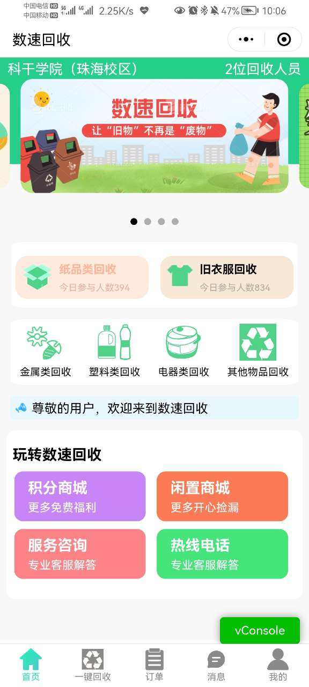
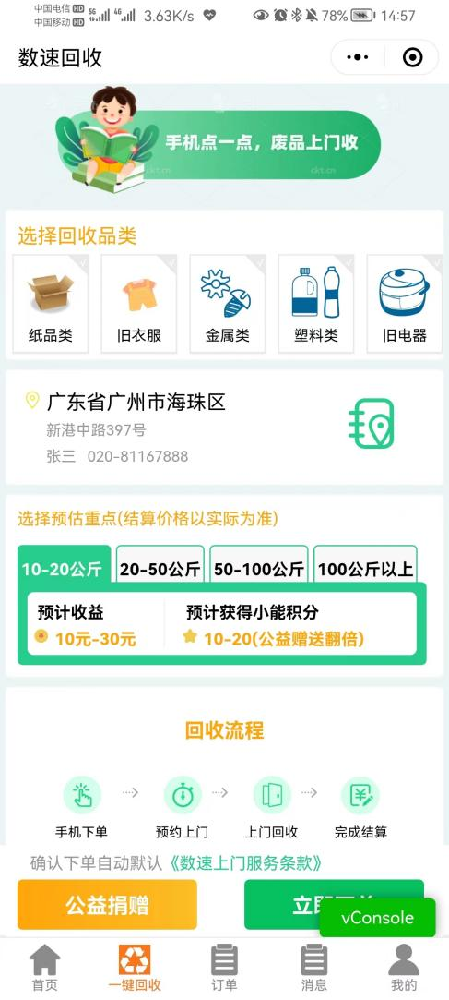
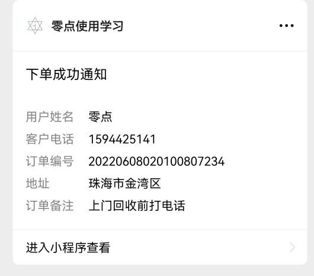
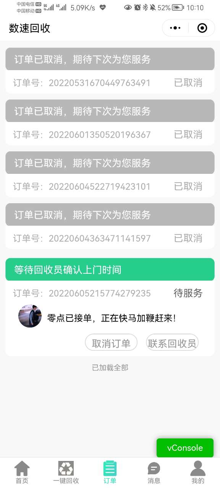
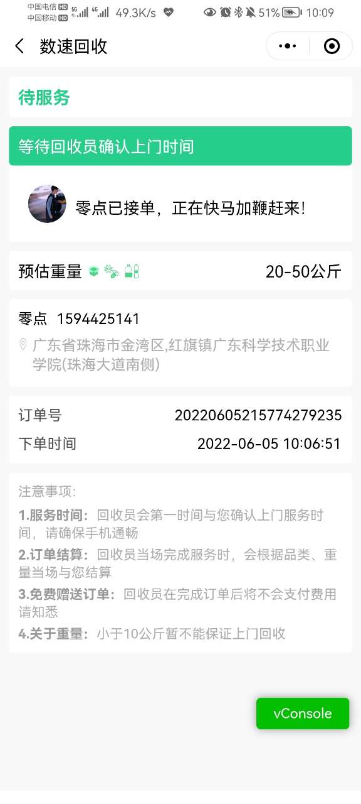
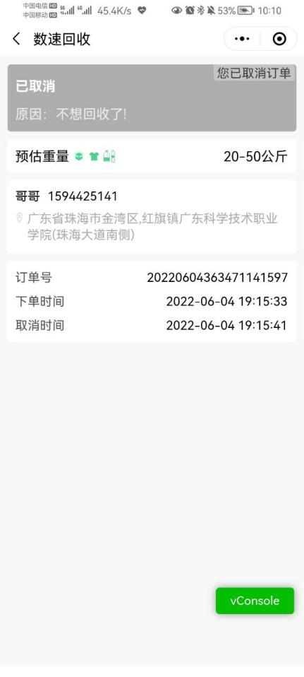

# 数速回收小程序

#### 介绍
这是一个带专大二学习开发了几天的数速回收小程序（作业），实现互联网+进行废品回收

在以后有时间将进行重构，第一次写那么多代码，虚心请教。
涉及到的key，templateId，envID等，请填写自己的。

#### 软件架构
软件架构说明
小程序当中使用到了腾讯地图开发，请自行申请key
#### 安装教程

#### 使用说明

效果图如下：

